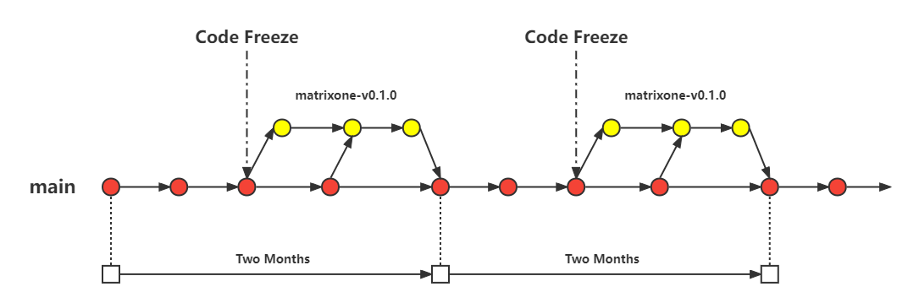

## Branch Specification

### 1.Branch Graph

### 2. Branch Structure

- **master branch**: Main branch, long-term existence.
- **release branch**: Internal publishing branch, published every two weeks. The company develops on this branch internally. After development, cherry pick the contents of this branch back to the master branch.
- **matrixone branch**: The official version release branch is released every two months. It is created after four internal releases for the release of the official version.

### 3. Branch Name

- **matrixone branch**: A official version corresponds to a matrixone branch, which is published in the version order. For example: matrixone-v0.1.0
- **release branch**: An internal development version corresponds to a release branch. It is released according to the official version number of the current development and the current time. For example, the official version of the current development is matrixone-v0.1.0. The current time is June 23, 2022, so the current branch is named release-0.1.0-20220623

### 4. Branch Process

When developing a new formal version, the overall R & D cycle should be divided into four internal version R & D cycles, and corresponding internal R & D branches should be created in chronological order.

In each internal R &amp; D cycle, if there is a new commit on the master branch, it should be merged into the current internal R &amp; D branch in time. After the current internal R &amp; D cycle ends, it should be merged back to the master branch and the next internal R &amp; D cycle should be started.

When the four internal R &amp; D cycle iterations are completed, a matrixone branch should be created for the release of the official version. After the official version is released, if there is a commit on the master branch that affects the version, it should be merged into the matrixone branch in time.

Refer to `PR Specification` for branch usage specifications in the specific development process.