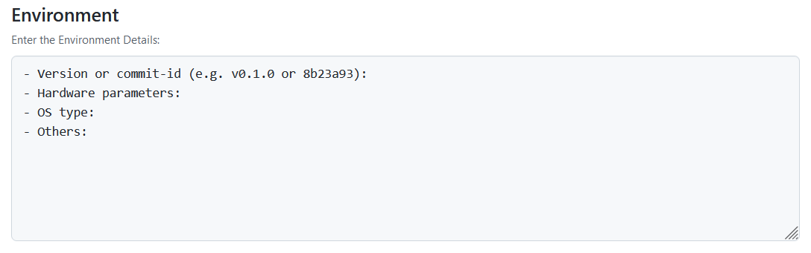

## issue

### **Bug report**

1. 建议删除

2. 环境部分感觉太过于复杂，建议精简一下。

PS: 感觉可以在产品中加入一个功能，类似于

~~~bash
go env
~~~

能够让用户一键获取当前环境信息，在填写issue的时候直接复制就好了

### Performance question

同上

建议增加一个**检查是否是最新版本选项**

## PR

增加对PR所修复问题或者添加功能的简单描述模块

增加是否会对用户使用造成影响的模块