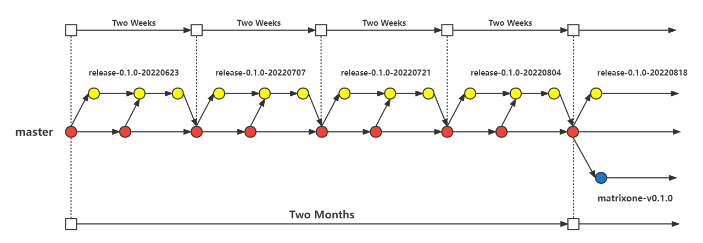

## 分支规范

### 1. 分支图

### 2. 分支结构

- **master 分支**：主分支，长期存在。
- **release分支**：内部发布分支，每两周发布一次。公司内部在此分支上进行开发。开发完成后将本分支内容cherry pick回master分支。
- **matrixone分支**：发布分支，每两个月发布一次。在经历四个内部发布之后创建，用于正式版本的发布。

### 3. 分支命名

- **matrixone 分支**：一个正式版本对应一个matrixone分支，发布时按照版本顺序进行发布。例如：matrixone-v0.1.0
- **release分支**：一个内部版本对应一个release分支，发布时按照当前开发正式版本号以及当前时间进行发布。例如：当前版本为matrixone-v0.1.0，当前时间为2022年6月23日，所以当前分支命名为release-0.1.0-20220623

### 4. 分支流程

每当进行一个新的正式版本的开发时，应将其整体研发周期拆分为四个内部版本研发周期，并按照时间顺序创建相应的内部研发分支。

在每个内部研发周期中，若master分支上有新的commit，应该及时合并到当前内部研发分支上。在当前内部研发周期结束后，应将其合并回master分支，并开启下一个内部研发周期。

当四个内部研发周期迭代结束后，应当创建matrixone分支，用于正式版本的发布。正式版本发布之后，若master分支上有对该版本影响的commit，应及时合并到该matrixone分支。

具体开发过程中分支使用规范详见`PR规范`。