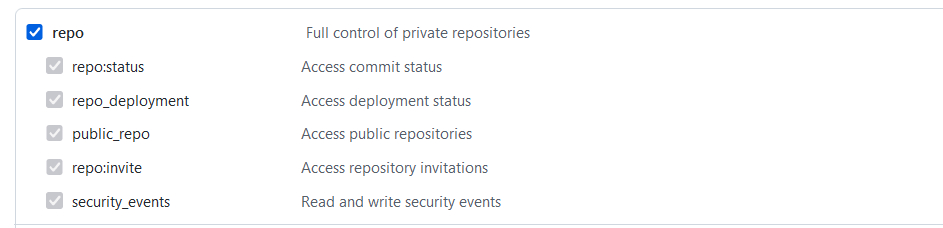
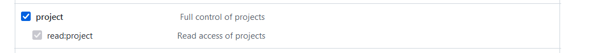

# Auto Add Issue to Project

1. 生成token（需要repo和project完全权限）

   路径：Settings $\rightarrow$ Developer settings $\rightarrow$ Personal access tokens

   或直接使用链接：https://github.com/settings/tokens

   

   

2. 配置仓库secrets context

   链接：https://github.com/matrixorigin/matrixone/settings/secrets/actions

​					New repository secret  $\rightarrow$ 填写刚才的token

​								Name: ADD_TO_PROJECT_PAT

​								Value: 刚才生成的token

3. 填写yaml文件

   PR链接：https://github.com/matrixorigin/matrixone/pull/3765（）